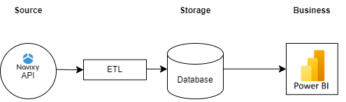
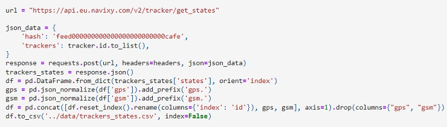
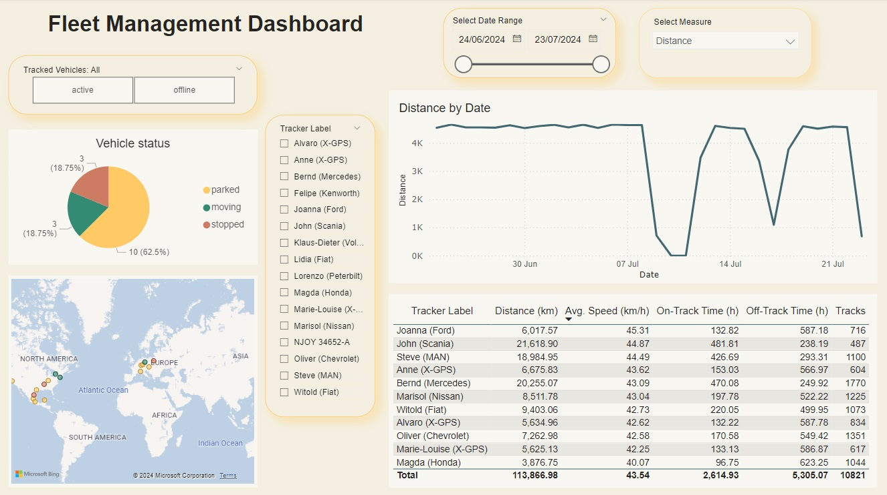
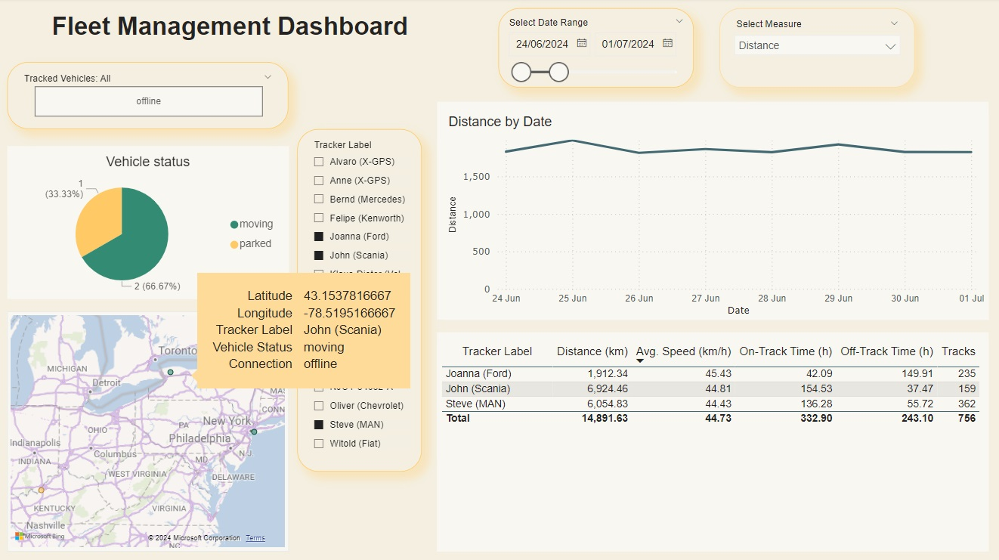

# 4. Working with ETL steps based on API queries.

### Task: 

You work for a company that manages a vehicle fleet. You have a real-time monitoring system with detailed analysis of objects and their statuses. You need to organize a separate online dashboard, which will be available on a separate WEB resource. This dashboard should show summary information (current status) on vehicles in the fleet (for example, how many objects are in motion, how many are parked, and so on). Vehicle statuses and data can be collected using the get_states API call, connecting to https://api.eu.navixy.com/v2 using the key “feed00000000000000000000000cafe”.

### You need to:

Create a dashboard for any BI tool (Power BI, SuperSet, Metabase, etc.) with significant information that will be useful to the fleet manager. So that the created dashboard is located (embedded) on a separate WEB resource.

### Solution:

After reading the [Navixy API description](https://developers.navixy.com/backend-api/getting-started/introduction/), I performed a series of API calls using Python to collect the most relevant information on the trackers (Navixy key entity, tracking device registered in Navixy GPS monitoring system) available for the provided key. 

It is possible to flow data to Power BI directly from the API (**Get data** -> **Web** -> **Advanced**) and transform it using Power Query.

However, I find working with Python to be more flexible for exploring available data and transforming it to meet business needs. The overall data flow should be as follows, with ETL performed using Python. For this specific project, the 'Database' part is simplified, and the data ready for visualization is stored locally in several .csv files.

Let me highlight a few moments from the process of requesting the data from the Navixy API, as described in the [get_data](get_data.ipynb) notebook. 

To get the trackers' states, we first need to obtain all the tracker_ids available for the key. The only needed libraries are pandas, json and requests.

The states of all trackers are available when the list of tracker IDs is passed. However, one should be aware of different JSON schemas in the response and adjust the Python script to transform the data accordingly.

The response JSON is described at [Navixy Developer Hub](https://developers.navixy.com/backend-api/resources/tracking/tracker/#get_states) and the full data saved in [trackers_states.csv](../data/trackers_states.csv).

The attributes of interest for visualization are: 
- connection_status,
- movement_status,
- latitude, and
- longitude.

Interestingly, only one of the trackers turned out to be active; the others' last update date was 2024-07-23. I also tried to collect information on drivers, vehicles, fuel levels, sensor readings, and inputs and saved the data in .csv files:
- [employee.csv](../data/employee.csv)
- [vehicle.csv](../data/vehicle.csv)
- [fuel_states.csv](../data/fuel_states.csv)
- [diagnostics.csv](../data/diagnostics.csv)
- [inputs.csv](../data/inputs.csv)
- [readings.csv](../data/readings.csv)
- [last_gps_point.csv](../data/last_gps_point.csv) (the GPS information from this endpoint is exactly the same we previously retrieved from "tracker/get_states")
- [mileage.csv](../data/mileage.csv) (the most accurate and comprehensive additional information available on the trackers)

However, most of the data is partial and therefore not valuable for visualization.

That's why I decided to use the [tracks data](https://developers.navixy.com/backend-api/resources/tracking/track/#list) to provide more information about the fleet on the dashboard. I retrieved the corresponding tracks for the last month, with regard to the date of the last update for the trackers. Although track data is available for only 14 out of 16 trackers, it allows for a detailed view of tracker activity: 
- the number of tracks per day,
- duration (calculated based on start/end timestamps),
- distance traveled (to be compared with mileage, accessed through [/tracker/stats/mileage](https://developers.navixy.com/backend-api/resources/tracking/tracker/stats/stats_mileage/) endpoint),
- off-track (idle) time, and
- average speed. 

I conducted exploratory data analysis and performed transformations to obtain the main statistics on the trackers' activity for the last month (2024-06-23 to 2024-07-23). See the [track_calculations](track_calculations.ipynb) notebook. 

Exploratory data analysis showed that, unfortunately, the data on fuel consumption is partial (available for only 2 out of 14 vehicles); therefore, there's no sense in visualizing it. There are 2 dates for which the data on tracks is missing completely. Several reasons could explain this: the data was corrupted and deleted, the data was not recorded appropriately, or there were more than two full days off for all drivers in the company (highly unlikely). We should explicitly add information on no tracks completed during this period to the aggregated data.

I visualized the values distribution for different trackers side by side, which allowed to spot abnormal data (see the second histogram, showing significant deviation from the normal distribution). I noticed that two of the abnormal data subsets featured tracks with the same start and end addresses (69% and 79% of all tracks).

Calculations of the average length, duration, speed, and number of tracks for each tracker further confirmed the anomalies in the data from trackers 3036045, 3036057, and 3036069.

When aggregating data the main challenge I faced was separating tracks that spanned more than one day into two parts. However, using the duration data and accurately calculated average speed for each track, I was able to determine the distance traveled for tracks spanning two days, broken down by each day.

I compared the aggregated distances and mileage from the mileage endpoint and found discrepancies between the daily distances traveled and the daily mileage for each tracker. On days with discrepancies, the end address of one track and the start address of the next track don't always match, indicating some vehicle travels may not be recorded as tracks. I decided that mileage data would be redundant and unnecessary for this specific dashboard.

When calculating averages for aggregated data I noticed that apart from the previously identified abnormal trackers (3036045, 3036057, and 3036069), there are three other trackers that stand out due to their mean daily duration and length (877766, 877767, 877768). This is likely because the same vehicle (and tracker) is used by two different drivers each day.

Since the dashboard would allow for aggregating data by specific groups of trackers and would also provide overall metrics, I decided to remove the abnormal data from three trackers discussed earlier and checked the whole aggregated dataset for missing data. Not only there were 2 dates, when tracks data was missing completely, but also there were 6 trackers that missed data for 3 other days of July. I added zero length, duration, average speed and 24 hours of off-track time for those days.

The datasets used for the dashboard are:

- [tracker_label.csv](../data/tracker_label.csv): Contains names for each tracker (driver's name and vehicle).
- [trackers_states_viz.csv](../data/trackers_states_viz.csv): Contains tracker state data with unnecessary attributes removed.
- [stats.csv](../data/stats.csv): Shows aggregated daily track data for each tracker.

The dashboard enables the fleet manager to view the current status of each tracker in the fleet, categorized by connection status: active or offline. It also displays the last update of the vehicle status—whether it is moving, stopped, or parked—along with its location shown on the map.

The dashboard allows selecting multiple trackers (using **Ctrl** key on the keyboard) by clicking on the map, selecting trackers by vehicle status, or choosing the Tracker Labels from the list. The manager can observe the main statistics for individual trackers or aggregated for several trackers in a table format and as a line chart by selecting the date range.

When several trackers are selected, their aggregated data is displayed in the table. This allows for comparison of measurements over a specific date range, reordering the results differently, and observing daily totals for the entire group on the line chart.

When the dashboard was ready in my Power BI Desktop, I published it to Power BI ([see instructions here](https://learn.microsoft.com/en-us/power-bi/create-reports/desktop-upload-desktop-files)).
Then I needed to [obtain the embed link](https://learn.microsoft.com/en-us/power-bi/collaborate-share/service-publish-to-web) to embed the dashboard into my newly created GitHub web page ([instructions](https://docs.github.com/en/pages/getting-started-with-github-pages/creating-a-github-pages-site) for [pages.github.com](https://pages.github.com/)).

See the embedded dashboard through the following link: [annatsh.github.io/dashboard](https://annatsh.github.io/dashboard/).
